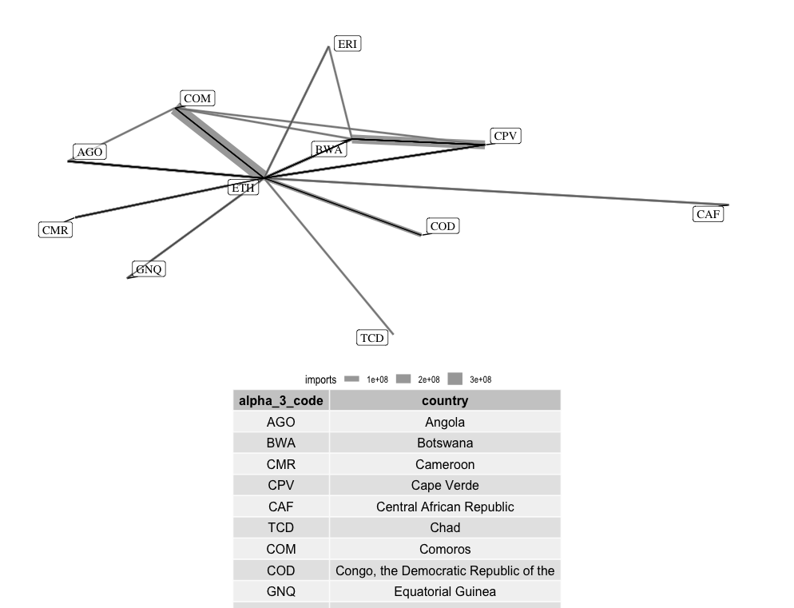

## Using Network Analysis to Understand International trade

**Definitions**
------------------------
**A random graph** has two parameters: *N* and *P* where *N* represents the number of nodes, and *P* the probability distribution that connects a given set of nodes. **A node** is a vertex of a graph while **An edge** is a connection or link between **nodes**.

To perform network analysis in R, we use two packages; *tidygraph* and *ggraph*, both of which support common graph data structures like **dendrogram** and **igraph** from the *igraph* R package.

A country is said to have a trade *imbalance* if the country imports more than it exports. By calculating the trade balance, we can express trade relationship between countries as an undirected graph a.k.a a **Markov network** in statistical literature.

```
Trade balance = exports - imports
```
**Properties of Markov Networks**
--------------------------------
- All the variables are continuous
- observations have a multivariate Gaussian distribution with mean `Mu` and covariance matrix `E`

- We can use the graphical lasso method to estimate parameters. 

**Data Source**
---------------
As in my [other work](https://github.com/LNshuti/LNSHUTI.github.io), I use the Atlas of Economic Complexity from the Growth Lab at Harvard University because this data source is: 1) Detailed down to the product level that each country in the World trades from 1962 to 2019. 2) Standardized to simplify the process of building time series to track changes over time. 3) Regularly used and highly cited source with over *fifty thousand downloads*. It is also publicly available and can be downloaded [**here.**](https://dataverse.harvard.edu/dataset.xhtml?persistentId=doi:10.7910/DVN/H8SFD2)

For the purpose of this analysis, we focus on a handful of variables from the data:
- location_id: country identifier representing the importer.  
- partner_id: country identifier representing the exporter.
- product_id: product identifier. 
- imports: amount in dollars of a product that a country imports.
- exports: amount in dollars of a product that a country exports.
- year

|location_product | partner_id |year     | import_value | export_value|
:-----------------|:-----------|:--------|:-------------|:------------| 
|187_670          |116         |  2015   |9916          |         0   |
|226_670          |116         |  2017   |140197        |         0   |
|227_670          |116         |  2013   |0             |   1261266   |
|116_670          |187         |  2019   |0             |      9916   |
|227_670          |187         |  2018   |13000         |      9011   |

The WITS database identifies countries using ISO3 codes. Below is a crosswalk for East African countries.

|country                                |	alpha_3_code|	numeric_code |
:---------------------------------------|:------------|:-------------|
|Burundi	                              | BDI	        | 108          |  
|Congo, the Democratic Republic of the	| COD	        | 180          |
|Kenya	                                | KEN	        | 404          |
|Rwanda	                                | RWA	        | 646          |
|Tanzania, United Republic of	          | TZA	        | 834          |
|Uganda	                                | UGA	        | 800          |

For a full description of the data cleaning process, consult the R code under:

``` r
source("R/01_data_aggregation_task.R")
```




**References**
--------------
- Hastie, T., Tibshirani, R., Friedman, J.H. and Friedman, J.H., 2009. The elements of statistical learning: data mining, inference, and prediction (Vol. 2, pp. 1-758). New York: springer.
- Sadler, Jesse. Network Analysis with R. https://www.jessesadler.com/post/network-analysis-with-r/
- https://cran.r-project.org/web/packages/ggraph/vignettes/tidygraph.html
- https://www.data-imaginist.com/2017/ggraph-introduction-layouts/
- Katherine Ognyanova. Network analysis with R and igraph: NetSci X Tutorial.
  https://kateto.net/networks-r-igraph
- Matthew Kay (2021). tidybayes: Tidy Data and Geoms for Bayesian Models. R package version 3.0.2, https://mjskay.github.io/tidybayes/. DOI: 10.5281/zenodo.1308151.
- The Growth Lab at Harvard University. International Trade Data (SITC, Rev. 2). 2019-05-31. 2019. V5. Harvard Dataverse. URL. https://doi.org/10.7910/DVN/H8SFD2. doi/10.7910/DVN/H8SFD2